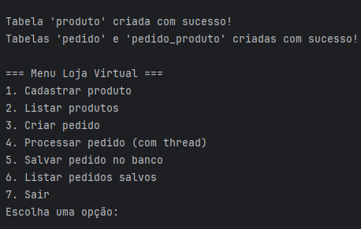
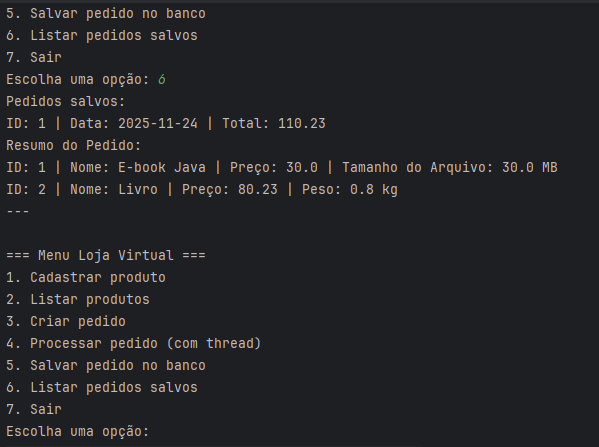

# Sistema de Cadastro e Processamento de Pedidos em uma Loja Virtual

## Descrição
Aplicação console em Java que simula uma loja virtual com cadastro de 
produtos, criação e processamento de pedidos com threads, e persistência 
de dados em SQLite.

## Funcionalidades Principais

1. **Cadastrar produto:** Adiciona produtos físicos (com peso se for fisico) ou digitais (com tamanho em MB se digital).
Além de Informar nome, preço e atributos específicos.
2. **Listar produtos:** Veja todos os produtos cadastrados, com ID, nome, preço e tipo (físico/digital).
3. **Criar pedido:** Monta um pedido adicionando produtos por ID. O sistema calcula automaticamente
   o valor total e armazena o pedido em memória.
4. **Processar pedido (Thread):** Simula o processamento dos itens em uma thread separada, com atraso de 1.5s por item
para simular o envio, exibindo o progresso no console.
5. **Salvar pedido no banco:** Persiste os pedidos no banco SQLite, incluindo data, total e itens associados.
6. **Listar pedidos salvos:** Exibe os pedidos armazenados no banco, com ID, data, total e resumo dos itens.
7. **Sair:** Encerra o programa e fecha conexões.

### Conceitos de POO Aplicados

- **Encapsulamento:** Uso de atributos privados e métodos getters/setters;

- **Herança:** Produto → ProdutoFisico / ProdutoDigital;

- **Polimorfismo:** Lista de produtos sendo tratada de forma genérica em Pedido;

- **Exceções personalizadas:** ListaVaziaException;

- **Threads:** ProcessadorDePedidos para simular o processamento simultâneo de pedidos;

- **DAO (Data Access Object):** Padrão para comunicação com o banco de dados.

## Tecnologias Usadas
- Java (JDK 8+)
- JDBC com SQLite
- Conceitos: Herança, Polimorfismo, Exceções, Threads

## Requisitos
- Java JDK instalado (versão 8 ou superior)
- Git para clonar o repo

## Como Rodar
1. Clone o repositório: `git clone https://github.com/seuusuario/LojaVirtualPOOJava.git`
2. Adicione o driver SQLite do projeto:
- Vá em File → Project Structure → Modules → Dependencies.
- Clique no + e escolha JARs or directories.
- Navegue até a pasta lib do projeto e selecione o .jar do SQLite.
4. Compile e rode a classe `Main.java`.
5. Siga o menu no console para cadastrar produtos, criar pedidos, etc.

*Projeto desenvolvido como atividade prática da disciplina de POO em Java.*
